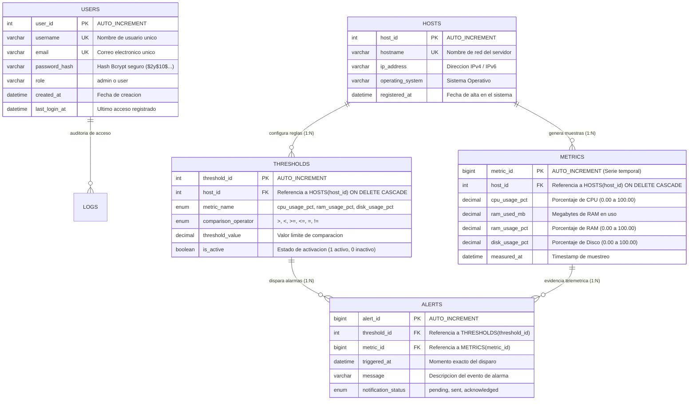

# Módulo de Base de Datos - Monitor Quintillizas

## Sistema de Gestión de Base de Datos Relacional (MySQL 8.0 / MariaDB / SQLite)
**Carrera:** Ingeniería en Sistemas Computacionales (5to Semestre)  
**Asignatura:** Taller de Base de Datos / Sistemas Distribuidos / Programación Web  
**Proyecto:** Monitor Quintillizas (Telemetría y Monitoreo de Infraestructura)  
**Repositorio Oficial:** [https://github.com/Monitor-Quintillizas/BD](https://github.com/Monitor-Quintillizas/BD)

---

## 1. Descripción del Módulo

El módulo de Base de Datos almacena y administra de forma centralizada:
1. **Usuarios y Operadores (`USERS`):** Cuentas con credenciales hasheadas con Bcrypt, roles de acceso (`admin` / `user`) y registro de actividad reciente.
2. **Inventario de Equipos y Servidores (`HOSTS`):** Nombres de host, direcciones IP y sistemas operativos supervisados.
3. **Telemetría de Series de Tiempo (`METRICS`):** Muestras históricas de uso de CPU (%), memoria RAM (MB y %), y almacenamiento en disco (%).
4. **Reglas de Umbrales (`THRESHOLDS`):** Condiciones lógicas y porcentajes límite parametrizados por equipo y métrica.
5. **Registro de Alertas (`ALERTS`):** Eventos de advertencia disparados en tiempo real cuando la telemetría excede las reglas.

---

## 2. Diagrama Entidad-Relación (Mermaid)



---

## 3. Diccionario de Datos Detallado

### Tabla: `USERS`
| Campo | Tipo | Nulo | Clave | Default | Descripción |
| :--- | :--- | :---: | :---: | :---: | :--- |
| `user_id` | `INT` | NO | **PK** | AUTO_INCREMENT | Identificador numérico único de la cuenta. |
| `username` | `VARCHAR(50)` | NO | **UK** | - | Nombre de usuario alfanumérico para login. |
| `email` | `VARCHAR(100)` | NO | **UK** | - | Correo institucional o de contacto del usuario. |
| `password_hash` | `VARCHAR(255)` | NO | - | - | Hash criptográfico generado mediante Bcrypt (`PASSWORD_BCRYPT`). |
| `role` | `VARCHAR(20)` | NO | - | `'user'` | Rol de seguridad en el sistema (`admin` o `user`). |
| `created_at` | `DATETIME` | NO | - | `CURRENT_TIMESTAMP` | Marca temporal del registro. |
| `last_login_at` | `DATETIME` | SÍ | - | `NULL` | Fecha y hora del último inicio de sesión exitoso. |

### Tabla: `HOSTS`
| Campo | Tipo | Nulo | Clave | Default | Descripción |
| :--- | :--- | :---: | :---: | :---: | :--- |
| `host_id` | `INT` | NO | **PK** | AUTO_INCREMENT | Identificador único del nodo o servidor. |
| `hostname` | `VARCHAR(100)` | NO | **UK** | - | Nombre de host en la red (ej. Servidor-Principal, Mi PC). |
| `ip_address` | `VARCHAR(45)` | NO | - | - | Dirección IP de red (soporta tanto IPv4 como IPv6). |
| `operating_system` | `VARCHAR(50)` | SÍ | - | `NULL` | Nombre y arquitectura del sistema operativo. |
| `registered_at` | `DATETIME` | NO | - | `CURRENT_TIMESTAMP` | Fecha de incorporación al inventario. |

### Tabla: `METRICS`
| Campo | Tipo | Nulo | Clave | Default | Descripción |
| :--- | :--- | :---: | :---: | :---: | :--- |
| `metric_id` | `BIGINT` | NO | **PK** | AUTO_INCREMENT | Identificador de alta cardinalidad para series temporales. |
| `host_id` | `INT` | NO | **FK** | - | Clave foránea referenciando `HOSTS(host_id)` con `ON DELETE CASCADE`. |
| `cpu_usage_pct` | `DECIMAL(5,2)` | NO | - | - | Carga del procesador expresada en porcentaje (0.00% a 100.00%). |
| `ram_used_mb` | `DECIMAL(10,2)`| NO | - | - | Memoria física utilizada en Megabytes. |
| `ram_usage_pct` | `DECIMAL(5,2)` | NO | - | - | Carga de memoria RAM en porcentaje (0.00% a 100.00%). |
| `disk_usage_pct`| `DECIMAL(5,2)` | NO | - | - | Uso del disco duro principal en porcentaje (0.00% a 100.00%). |
| `measured_at` | `DATETIME` | NO | - | `CURRENT_TIMESTAMP` | Estampa de tiempo exacta de captura de la muestra. |

### Tabla: `THRESHOLDS`
| Campo | Tipo | Nulo | Clave | Default | Descripción |
| :--- | :--- | :---: | :---: | :---: | :--- |
| `threshold_id` | `INT` | NO | **PK** | AUTO_INCREMENT | Identificador único de la regla de umbral. |
| `host_id` | `INT` | NO | **FK** | - | Clave foránea referenciando `HOSTS(host_id)` con `ON DELETE CASCADE`. |
| `metric_name` | `ENUM` | NO | - | `'cpu_usage_pct'` | Métrica a evaluar (`cpu_usage_pct`, `ram_usage_pct`, `disk_usage_pct`). |
| `comparison_operator` | `ENUM` | NO | - | `'>'` | Operador relacional (`>`, `<`, `>=`, `<=`, `=`, `!=`). |
| `threshold_value`| `DECIMAL(5,2)` | NO | - | - | Porcentaje límite de disparo. |
| `is_active` | `BOOLEAN` | NO | - | `1` | Estado de la regla (1 activo, 0 inactivo). |

### Tabla: `ALERTS`
| Campo | Tipo | Nulo | Clave | Default | Descripción |
| :--- | :--- | :---: | :---: | :---: | :--- |
| `alert_id` | `BIGINT` | NO | **PK** | AUTO_INCREMENT | Identificador único del evento de advertencia. |
| `threshold_id` | `INT` | NO | **FK** | - | Umbral que originó el disparo (`THRESHOLDS`). |
| `metric_id` | `BIGINT` | NO | **FK** | - | Muestra exacta de telemetría que violó la regla (`METRICS`). |
| `triggered_at` | `DATETIME` | NO | - | `CURRENT_TIMESTAMP` | Momento exacto de generación de la alerta. |
| `message` | `VARCHAR(255)` | NO | - | - | Texto descriptivo del incidente para el operador. |
| `notification_status` | `ENUM` | NO | - | `'pending'` | Estado del ciclo de vida (`pending`, `sent`, `acknowledged`). |

---

## 4. Guía de Respuestas para Defensa Académica y Revisión Oral

1. **¿Por qué `metric_id` y `alert_id` son de tipo `BIGINT` y no `INT`?**  
   Las métricas se generan automáticamente cada 2.5 segundos por cada host conectado. Un entero estándar `INT` de 32 bits permite hasta ~2,147 millones de registros, lo que en sistemas de telemetría continuos puede desbordarse en mediano plazo. `BIGINT` (64 bits) permite hasta $9.22 \times 10^{18}$ registros, garantizando escalabilidad permanente sin desbordamiento de clave primaria (*Primary Key Overflow*).

2. **¿Por qué se utiliza `DECIMAL(5,2)` en lugar de `FLOAT` o `DOUBLE`?**  
   `FLOAT` y `DOUBLE` emplean representación binaria de punto flotante aproximada bajo el estándar IEEE 754, lo que provoca imprecisiones de redondeo decimal (ej. `80.00000019`). `DECIMAL(5,2)` es un tipo de dato numérico de punto fijo exacto en base 10 (con 3 dígitos enteros y 2 decimales, ej. `100.00`), ideal para umbrales de precisión donde la igualdad y comparación deben ser matemáticamente exactas.

3. **¿Por qué `last_login_at` y `operating_system` permiten valores `NULL`?**  
   Porque son campos opcionales en el momento de creación del registro. Cuando un usuario se crea por primera vez, aún no ha iniciado sesión, por lo que `last_login_at` debe ser `NULL`. De igual forma, un host puede ser registrado antes de conocerse con exactitud el nombre detallado de su sistema operativo.

4. **¿Por qué la relación entre `HOSTS` y `METRICS` es de 1 a N (1:N)?**  
   Porque un único equipo físico o servidor registrado en `HOSTS` genera múltiples muestras cronológicas de telemetría a lo largo del tiempo en `METRICS`.

5. **¿Qué sucede si se elimina un registro de la tabla `HOSTS` o `USERS`?**  
   Gracias a las restricciones `ON DELETE CASCADE` declaradas en las claves foráneas de `METRICS`, `THRESHOLDS` y `ALERTS`, si un host es dado de baja, todas sus métricas, reglas y alertas asociadas se eliminan de manera atómica y automática, preservando la integridad referencial y evitando la existencia de registros huérfanos en la base de datos.

6. **¿Por qué `password_hash` tiene un tamaño de `VARCHAR(255)`?**  
   Los algoritmos criptográficos como Bcrypt (`PASSWORD_BCRYPT`) o Argon2 generan cadenas de longitud variable con salting dinámico. Reservar 255 caracteres asegura compatibilidad total ante futuras actualizaciones de algoritmos de seguridad sin tener que modificar la estructura de la tabla.

---

## 5. Ejecución y Restauración del Script SQL

### Vía Docker Compose (Automático):
El archivo [`bd/init.sql`](file:///c:/Users/Adrian/OneDrive/Documentos/ITESI/Servicio%20Social/Monitor%20Quintillizas/bd/init.sql) se monta automáticamente en el directorio `/docker-entrypoint-initdb.d/` del contenedor MySQL para inicializar las tablas y datos de prueba al primer arranque.

### Vía Línea de Comandos (Manual):
```bash
mysql -u root -p monitor_team_db < init.sql
```
